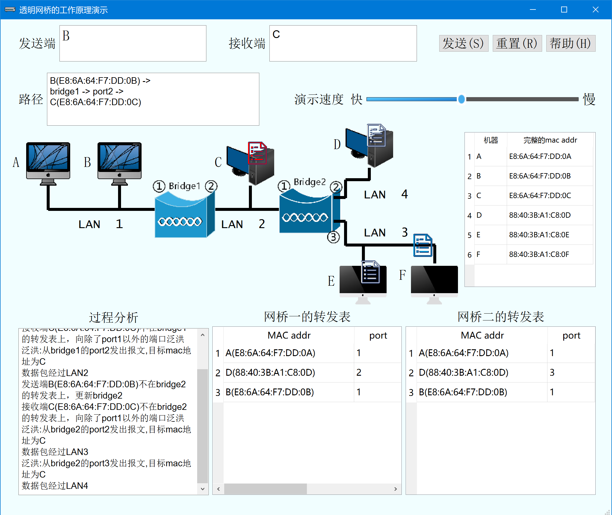

# Transparent-Bridge

## 项目背景

本项目是计算机网络课的小组加分作业，要求是完成某个图像化演示题目，根据完成度获得相应加分。我们实现了基于Qt的透明网桥工作原理图形化演示程序。程序能够演示处转发表从初始为空到逐步增加的逆向学习过程，包括学习时的泛洪、学习后的转发等。

**具体介绍都在Documents文件夹下的技术手册和用户使用说明中，非常详细。**

## 编译运行方法

使用Qt Creator打开，可以直接编译运行。

我使用的Qt Creator版本如下：

## 运行效果

